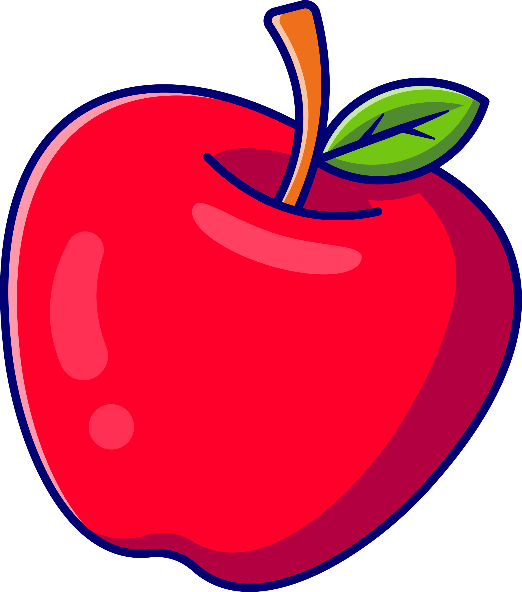

<div> 
  
  <h1>Jogo da Maçã </h1>
  <p >
   <a href="#-sobre">Sobre</a> •
   <a href="#%EF%B8%8F-Funcionalidades">Funcionalidades</a> •
   <a href="#-rodando-os-projetos">Rodando os Projetos</a> • 
   <a href="#-tecnologias">Tecnologias</a> • 
   <a href="#-autora">Autora</a>
  </p>
</div>


<br/>

## 💻 Sobre

O "Jogo da Maçã" é um projeto feito como exercício para a disciplina de Desenvolvimento Reativo do IGTI em Maio de 2021. A ideia era aprender a configurar o ambiente básico dos 3 frameworks/libs de Desenvolvimento Front-end mais utilizados do mercado: Angular, React e Vue. Para isso, criei uma espécie de jogo onde a ilustração de uma maçã é renderizada de forma randômica na tela e, cada vez que o usuário clica nela, um contador de cliques é incrementado. Também implementei um botão de "Resetar" que zera o contador.

<br/>

## ⚙️ Funcionalidades

- [x] Posicionar a imagem da maçã aleatoriamente na tela e permitir o incremento de um contador toda vez que a maçã recebe um evento de clique.

<br/>

## 🚀 Rodando os Projetos

Este repositório conta com 3 pastas principais que indicam a tecnologia utilizada:

* angular_app
* react_app
* vue_app

Cada uma delas possui instruções diferentes para rodar o projeto.

<br/>

### 🔧 Pré-requisitos

Antes de começar, você precisa ter as seguintes ferramentas instaladas no seu computador:

* [Git](https://git-scm.com)
* [Node.js](https://nodejs.org/en/)

Além disso, também é interessante ter um editor de texto instalado para trabalhar com o código. Recomendo a utilização do [VSCode](https://code.visualstudio.com/).

<br/>

### 🔴 Rodando em Angular

Na raiz da pasta do projeto em Angular (angular_app), rode os seguintes comandos:

```bash

$ npm install  # Instalando as dependências

$ ng serve --open  # Rodando a aplicação no modo de desenvolvimento

# O servidor será iniciado na porta 4200. No seu browser, acesse <http://localhost:4200>

```

<br/>

### 🔵 Rodando em React

Na raiz da pasta do projeto em React (react_app), rode os seguintes comandos:

```bash

$ npm install  # Instalando as dependências

$ npm start  # Rodando a aplicação no modo de desenvolvimento

# O servidor será iniciado na porta 3000. No seu browser, acesse <http://localhost:3000>

```

<br/>


### 🟢 Rodando em Vue

Na raiz da pasta do projeto em Vue (vue_app), rode os seguintes comandos:

```bash

$ npm install  # Instalando as dependências

$ npm run serve  # Rodando a aplicação no modo de desenvolvimento

# O servidor será iniciado na porta 8080. No seu browser, acesse <http://localhost:8080>

```

<br/>

## 🛠 Tecnologias

As seguintes tecnologias foram utilizadas na construção desse projeto:

-   **[Angular](https://angular.io/)**
-   **[ReactJS](https://reactjs.org/)**
-   **[VueJS](https://vuejs.org/)**

<br/>

## 👩‍💻 Autora

<table>
  <tr>
    <td align="center"><a href="https://github.com/gabrielalg"><br/><span><b>Gabriela Gonçalves</b></span></a><br/><a href="https://www.gabidigital.work/" title="Gabi Digital"><sub>🔗 Portfólio</sub></a></td>
  </tr>
</table>
